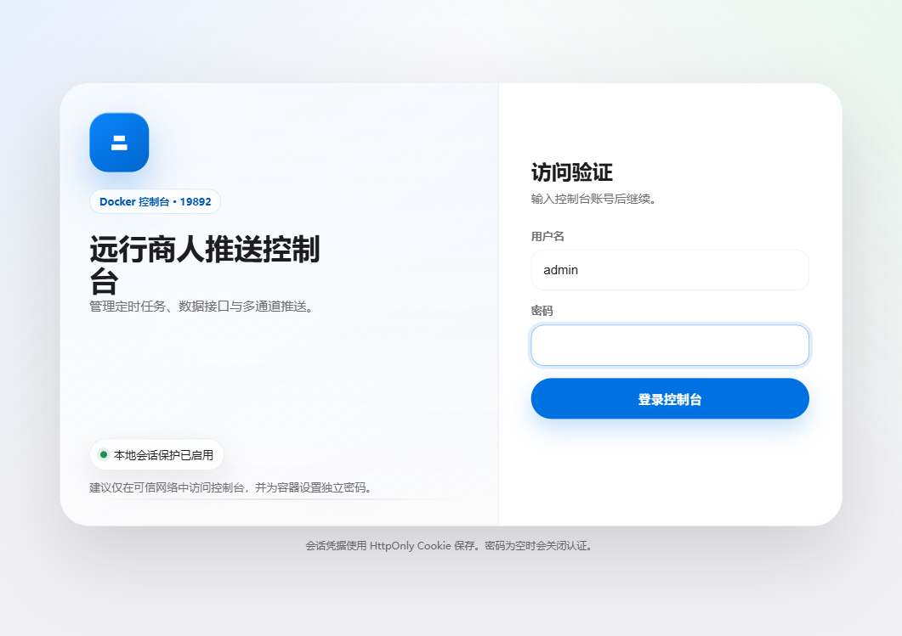
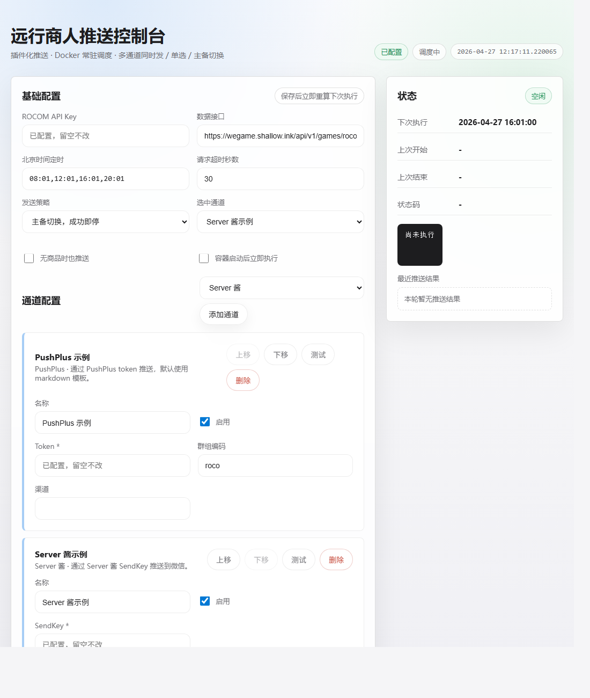
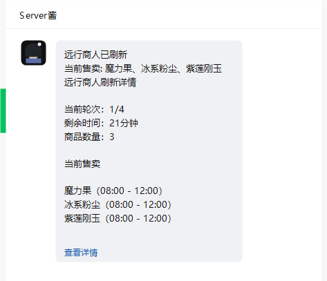

# 洛克王国世界远行商人推送控制台

[](https://hub.docker.com/r/linxi5013/roco-push-console)
[](https://www.python.org/)
[](LICENSE)

一个用于监控《洛克王国世界》远行商人刷新状态的 Docker 常驻服务。项目提供 Web 控制台，可以配置 WeGame 数据接口 Key、北京时间定时任务、多个推送通道和发送策略，并把刷新结果推送到微信、企业微信、飞书、钉钉、Bark、ntfy、Gotify 等服务。

> 当前版本只做文字 / Markdown 推送，不恢复图片渲染。

## 截图

登录页：



控制台：



Server 酱推送效果：



## 功能

- Docker 常驻运行，默认端口 `19892`
- Web 控制台管理配置，无需反复改环境变量
- 配置持久化到 `./data/config.json`
- 支持多通道同时发送、单通道发送、主备失败切换
- 支持单通道测试和按当前策略测试
- 敏感字段保存后不回显，页面显示“已配置，留空不改”
- 推送异常、HTTP 错误和服务商返回详情会脱敏，避免 token / readkey 出现在控制台状态区和 Docker 日志里
- 读取损坏配置时自动备份原文件，避免直接覆盖旧配置
- 容器启动时自动修正 `/data` 目录权限，适配 WSL / bind mount 场景

## 来源与鸣谢

本项目基于 [ALLCAPS-Droid/roco-merchant-notifier](https://github.com/ALLCAPS-Droid/roco-merchant-notifier) 修改而来，保留远行商人数据解析和定时推送思路，并改造成 Docker 常驻服务、Web 控制台和多推送通道版本。

本项目的数据源由 [Entropy-Increase-Team](https://github.com/Entropy-Increase-Team/) 提供。你需要前往该项目主页或相关社区，获取用于调用 WeGame 接口的 `ROCOM_API_KEY`。

## 安全提醒

默认 `docker-compose.yml` 会让容器内控制台监听 `0.0.0.0`，并发布到宿主机 `19892` 端口；同时 `CONSOLE_PASSWORD` 为空时会关闭 Web 控制台认证。这对本地首次部署比较方便，但如果机器能被局域网或公网访问，就等同于把管理端暴露出去。

公开部署或共享服务器上至少要做这几件事：

- 在 `.env` 里设置强密码：`CONSOLE_PASSWORD=换成你的控制台密码`
- 只在可信网络内开放 `19892`，或用防火墙 / 反向代理限制访问来源
- 如果只想本机访问，把 compose 端口改成 `127.0.0.1:${WEB_PORT:-19892}:19892`
- 不要提交或公开 `./data/config.json`，里面会明文保存推送 token 和接口 Key

## 快速开始

### 方式一：Docker Hub 镜像

```bash
docker run -d \
  --name roco-push-console \
  --restart unless-stopped \
  -p 19892:19892 \
  -v ./data:/data \
  -e CONSOLE_USERNAME=admin \
  -e CONSOLE_PASSWORD=换成你的控制台密码 \
  linxi5013/roco-push-console:latest
```

启动后打开：

```text
http://服务器IP:19892
```

可用镜像标签：

```bash
docker pull linxi5013/roco-push-console:latest
docker pull linxi5013/roco-push-console:0.1.3
docker pull linxi5013/roco-push-console:0.1.2
docker pull linxi5013/roco-push-console:0.1.1
docker pull linxi5013/roco-push-console:0.1.0
```

### 方式二：docker compose

```bash
git clone https://github.com/adrian803/roco-push-console.git
cd roco-push-console
cp .env.example .env
```

修改 `.env`，至少设置控制台密码：

```env
CONSOLE_USERNAME=admin
CONSOLE_PASSWORD=换成你的控制台密码
WEB_PORT=19892
```

启动：

```bash
docker compose up -d
```

本地重新构建：

```bash
docker compose up -d --build
```

## 首次配置

进入控制台后按这个顺序配置：

1. 在“基础配置”填写 `ROCOM_API_KEY`。
2. 确认“数据接口”，通常保持默认即可。
3. 设置“北京时间定时”，格式如 `08:01,12:01,16:01,20:01`。
4. 在“通道配置”添加推送通道，填写对应 token / webhook。
5. 点击单个通道的“测试”，确认能收到测试消息。
6. 选择发送策略并保存配置。
7. 点击“立即执行”做一次手动检查。

配置保存后会写入：

```text
./data/config.json
```

## 推送通道

| 通道 | 必填配置 | 说明 |
| --- | --- | --- |
| Server 酱 | SendKey | 通过 Server 酱推送到微信 |
| PushPlus | Token | 支持 topic、channel，默认 Markdown |
| Wecom 酱 / 企业微信应用 | CorpID、Secret、AgentID、接收人 | 自动获取并缓存企业微信 access token |
| 企业微信群机器人 | Webhook 或 Key | 发送 Markdown 消息 |
| WxPusher | AppToken | 支持 UID 列表或 Topic ID 列表 |
| Bark | Server URL、Device Key | 推送到 iOS Bark |
| 钉钉群机器人 | Webhook | 可选 secret 加签 |
| 飞书群机器人 | Webhook | 可选 secret 加签 |
| ntfy | Base URL、Topic | 可选 bearer token、priority、tags |
| Gotify | Base URL、App Token | 可配置 priority |

### 通道卡片说明

每个通道卡片只展示日常会用到的配置：

- `名称`：给自己看的显示名，比如“我的 Server 酱”“备用 PushPlus”。
- `启用`：关闭后该通道不会参与发送。
- 服务商参数：例如 Server 酱的 `SendKey`、PushPlus 的 `Token`、企业微信机器人的 `Webhook`。

程序内部会自动为每个通道生成稳定 ID，用来保存配置、测试单个通道和执行主备切换。这个 ID 对普通使用没有实际操作意义，所以控制台不展示，也不需要手动填写。

如果使用“主备切换，成功即停”，发送顺序就是页面里的通道卡片顺序。可以用卡片右上角的“上移”“下移”调整优先级，越靠上越先尝试。

## 发送策略

| 策略 | 行为 |
| --- | --- |
| 所有启用通道同时发送 | 向全部启用通道发送，至少一个成功即认为本轮有送达 |
| 只发送选中通道 | 只向下拉框选中的通道发送 |
| 主备切换，成功即停 | 按页面通道列表顺序尝试启用通道，第一个成功后停止 |

## 环境变量

`.env` 里的 `ROCOM_API_KEY` 和 `SERVERCHAN_SENDKEY` 只是首次启动默认值。启动后更推荐在 Web 控制台修改，配置会持久化到 `./data/config.json`。

| 变量 | 默认值 | 说明 |
| --- | --- | --- |
| `DOCKER_IMAGE` | `linxi5013/roco-push-console:latest` | compose 使用的镜像 |
| `WEB_PORT` | `19892` | 宿主机访问端口 |
| `CONSOLE_USERNAME` | `admin` | 控制台用户名 |
| `CONSOLE_PASSWORD` | 空 | 控制台密码；为空时不启用认证，部署到可访问网络前必须设置 |
| `CONSOLE_SESSION_TTL` | `86400` | 控制台登录态有效期，单位秒 |
| `CONSOLE_SESSION_SECRET` | 空 | Cookie 签名密钥；默认使用控制台密码 |
| `ROCOM_API_KEY` | 空 | 首次启动默认 WeGame 接口 Key |
| `ROCOM_API_URL` | 空 | 自定义 WeGame 数据接口，通常保持空使用内置默认值 |
| `SERVERCHAN_SENDKEY` | 空 | 兼容旧配置，首次启动时创建 Server 酱通道 |
| `DELIVERY_MODE` | `all` | 首次启动默认发送策略：`all` / `single` / `failover` |
| `SCHEDULE_TIMES` | `08:01,12:01,16:01,20:01` | 首次启动默认定时 |
| `RUN_ON_START` | `false` | 容器启动后是否立即执行一次 |
| `NOTIFY_EMPTY` | `false` | 没有商品时是否也推送 |
| `HTTP_TIMEOUT` | `30` | 请求超时秒数 |

## 常用命令

查看日志：

```bash
docker compose logs -f
```

重启：

```bash
docker compose restart
```

升级到最新镜像：

```bash
docker compose pull
docker compose up -d
```

停止并移除容器：

```bash
docker compose down
```

备份配置：

```bash
cp ./data/config.json ./config.backup.json
```

## 本地开发

环境准备：

```bash
uv sync --frozen
```

启动 Web 控制台：

```bash
uv run python -m roco_push_console.web
```

一次性执行检查：

```bash
uv run python main.py
```

本地测试：

```bash
uv run python -m unittest discover -s tests
uv run python -m compileall -q src main.py tests
docker compose config --quiet
```

构建镜像：

```bash
docker build -t roco-push-console:latest .
```

## 常见问题

### 为什么打开控制台不需要密码？

`CONSOLE_PASSWORD` 为空时会关闭认证。部署到局域网或公网前请设置 `CONSOLE_PASSWORD`。

### 为什么提示缺少 `ROCOM_API_KEY`？

需要先从 [Entropy-Increase-Team](https://github.com/Entropy-Increase-Team/) 项目主页或相关社区获取用于调用 WeGame 接口的 `ROCOM_API_KEY`，再填入控制台或 `.env`。

### 为什么修改 `.env` 后页面没变？

控制台保存过配置后，会优先读取 `./data/config.json`。后续更推荐直接在 Web 控制台修改；如果要完全重新使用 `.env` 默认值，需要先备份并移走 `./data/config.json`。

### 为什么收不到推送？

先在“通道配置”里点击单通道“测试”。如果测试失败，检查 token / webhook 是否正确、服务商是否限流、服务器是否能访问对应推送服务。

### 配置文件损坏怎么办？

程序读取 `config.json` 失败时，会把损坏文件备份为 `config.json.invalid-时间戳.bak`，并在控制台状态区显示提示。

### 点击“保存配置”提示保存失败怎么办？

新版镜像启动时会自动修正 `/data` 目录权限。旧容器如果已经创建过 `./data`，尤其是在 Ubuntu WSL 里运行 Docker、并把项目目录 bind mount 到容器时，可能出现容器内应用用户无法写入 `/data/config.json.tmp` 的情况。

如果控制台保存时报 `Permission denied`，先在 WSL 的 Ubuntu 终端执行：

```bash
docker exec -u root roco-push-console chown -R app:app /data
```

然后刷新控制台再保存。长期建议更新到新版镜像并重建容器：

```bash
docker compose pull
docker compose up -d --force-recreate
```

## 路线图

- 支持更多推送平台
- 将控制台页面拆分为静态资源，降低 `web.py` 体积
- 增加 GitHub Actions 自动构建和镜像发布
- 增加更完整的端到端测试

## 贡献

欢迎提交 issue 和 pull request。比较适合贡献的方向包括：

- 新推送通道
- 控制台交互优化
- Docker 部署文档
- 测试用例
- 不同平台的部署经验

提交 PR 前建议先运行：

```bash
uv run python -m unittest discover -s tests
uv run python -m compileall -q src main.py tests
docker compose config --quiet
```

## 免责声明

本项目是个人学习和自用工具，和游戏官方、WeGame、各推送平台均无从属关系。请遵守相关服务条款，不要滥用接口或推送能力。

## 许可

本项目使用 [MIT License](LICENSE)。
